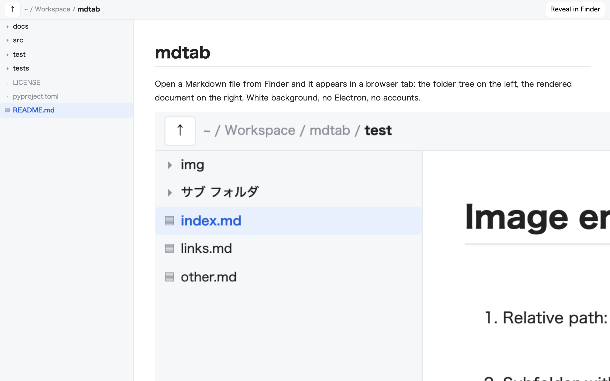

# mdtab

Open a Markdown file from Finder and it appears in a browser tab: the folder tree on the left, the rendered document on the right. White background, no Electron, no accounts.



- Double-click a `.md` in Finder (after `mdtab install --default`) or run `mdtab open file.md`
- Left pane: the folder that contains the file. Expand subfolders, go up with `↑`, click any `.md`
- Live reload: the document re-renders when the file changes on disk
- Images and attachments resolve relative to the Markdown file
- Links to local `.md` files navigate in the same tab; external URLs open in a new tab
- "Reveal in Finder" button

## Install

```sh
brew install pandoc            # renderer (GitHub-flavored Markdown)
uv tool install mdtab          # or: pipx install mdtab / pip install mdtab
mdtab install --default        # macOS: launchd agent + MDTab.app, make it the default .md app
```

macOS asks once to confirm the default-app change. Then:

```sh
open README.md                 # Finder double-click does the same
mdtab open README.md           # works without the default-app setup
```

No pandoc? `uv tool install "mdtab[markdown]"` installs python-markdown as a fallback renderer (nested lists need 4-space indents there).

## Commands

| Command | What it does |
|---|---|
| `mdtab open [file.md]` | Start the server if needed and open the file in your default browser |
| `mdtab serve [--port N]` | Run the server in the foreground (this is what launchd runs) |
| `mdtab install [--default]` | macOS: write the launchd agent, build `~/Applications/MDTab.app`, register it for Markdown; `--default` makes it the default handler |
| `mdtab uninstall` | Remove the agent and the app |

`serve` and `open` work on any OS; `install`/`uninstall` are macOS only.

## How it works

| Piece | Role |
|---|---|
| `mdtab/server.py` | HTTP server on `127.0.0.1:7331`. Routes: `/view`, `/api/tree`, `/api/file`, `/api/raw`, `/api/mtime`, `/api/reveal` |
| `mdtab/static/` | Single-page UI |
| `mdtab/cli.py` | `mdtab` command |
| `mdtab/macos.py` | launchd plist, AppleScript droplet compiled with `osacompile`, LaunchServices registration |

The launchd agent runs `<the python mdtab was installed with> -m mdtab serve`, so it follows whatever uv/pipx/venv you installed into.

## Security notes

- Binds to `127.0.0.1` only.
- Serves only paths under `$HOME`; anything else returns `bad file`.
- Raw HTML in Markdown is rendered (so `` works). This is a viewer for your own local files; do not expose it to a network.

## Development

```sh
git clone https://github.com/Tdual/mdtab.git && cd mdtab
uv tool install --force ".[markdown]"      # or: pip install -e ".[markdown]"
python -m unittest discover -s tests -v
mdtab open test/index.md                   # images, links, a folder with a space in its name
```

Releases are published to PyPI by the `Publish to PyPI` workflow when a `v*` tag is pushed (Trusted Publishing).

## License

MIT
